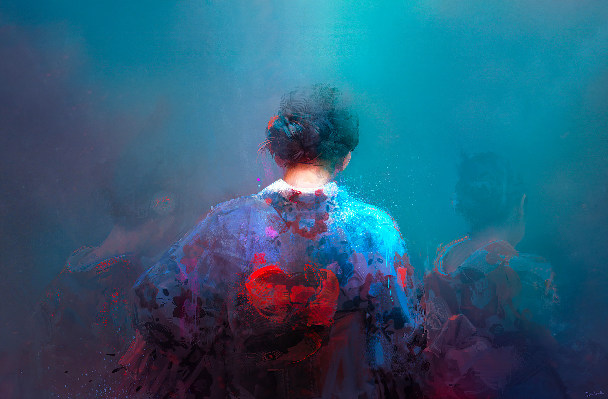

# Quark1973

### Agent Development · Golang Engineering · Graphics Enthusiast

I build practical software systems with a focus on agent development, Go engineering, and backend architecture.  
I am also passionate about computer graphics and interested in combining intelligent systems with visual computing.

 

## Focus

Agent Development · Golang Engineering · Backend Systems · Computer Graphics

 

## Tech Stack

  

 

## Activity

 

## GitHub Stats

